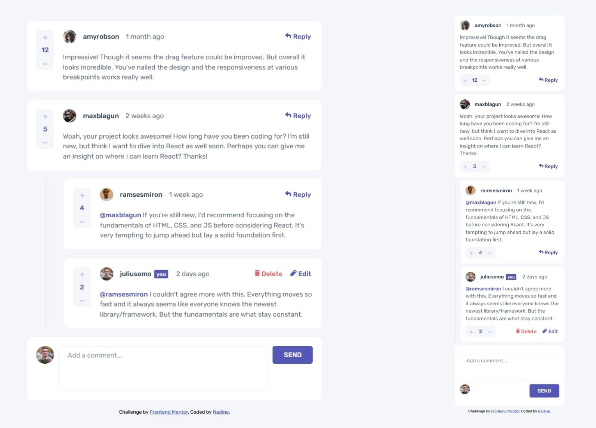

# Frontend Mentor - Interactive comments section solution

This is a solution to the [Interactive comments section challenge on Frontend Mentor](https://www.frontendmentor.io/challenges/interactive-comments-section-iG1RugEG9). Frontend Mentor challenges help you improve your coding skills by building realistic projects. 

## Table of contents

- [Overview](#overview)
  - [The challenge](#the-challenge)
  - [Screenshot](#screenshot)
  - [Links](#links)
- [My process](#my-process)
  - [Built with](#built-with)
  - [What I learned](#what-i-learned)
  - [Continued development](#continued-development)
- [Author](#author)

## Overview

### The challenge

Users should be able to:

- View the optimal layout for the app depending on their device's screen size
- See hover states for all interactive elements on the page
- Create, Read, Update, and Delete comments and replies
- Upvote and downvote comments
- **Bonus**: If you're building a purely front-end project, use `localStorage` to save the current state in the browser that persists when the browser is refreshed.
- **Bonus**: Instead of using the `createdAt` strings from the `data.json` file, try using timestamps and dynamically track the time since the comment or reply was posted.

### Screenshot

### Links

- Solution URL: [https://github.com/nadlgit/interactive-comments-section](https://github.com/nadlgit/interactive-comments-section)
- Live Site URL: [https://nadlgit.github.io/interactive-comments-section](https://nadlgit.github.io/interactive-comments-section)

## My process

### Built with

- [React](https://reactjs.org/) - JS library
- CSS Grid
- Flexbox
- CSS custom properties
- Mobile-first workflow
- Responsive design

### What I learned

This is my second React project. I have now a better understanding of some React hooks: useState, useReducer, useEffect, use LayoutEffect, useRef, useMemo, useContext.

I also played with dates, through [date-fns](https://date-fns.org/) package, to display a refreshed relative created date: a few seconds ago, 1 minute ago, etc.

And I learned how to make a modal with CSS.

### Continued development

- I didn't find a working solution to prevent user to click multiple times on "Reply". My workaround is to create as many replies as clicked, but I don't like it.

- It would be interesting to develop storage, either in the browser like suggested in bonus or with a real backend.

- Error handling should be improved. I made a very basic use of [react-error-boundary](https://github.com/bvaughn/react-error-boundary), and tried to use useErrorHandler hook without success.

## Author

- Frontend Mentor - [@nadlgit](https://www.frontendmentor.io/profile/nadlgit)